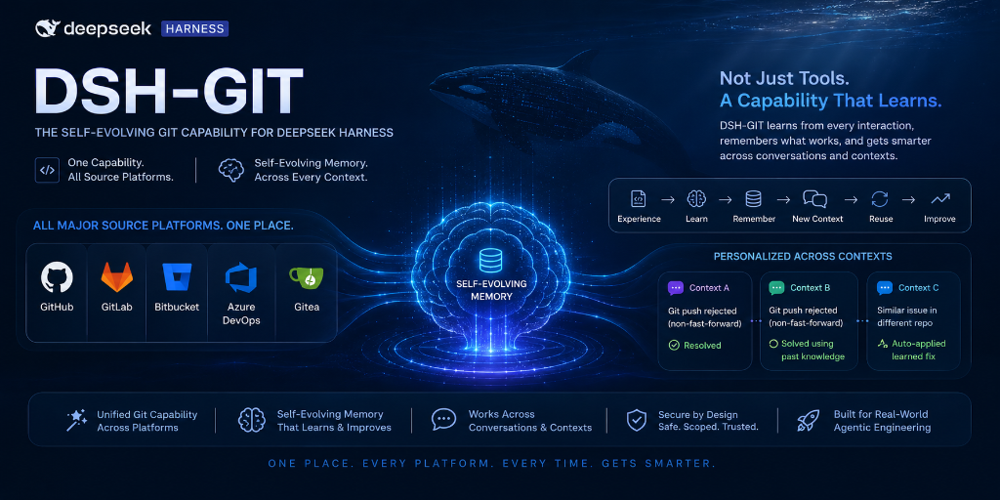

# dsh-git · Git & Source-Control Plugin Suite for DeepSeek Harness — with Self-Evolving Memory



[](https://awesome-dsh-plugin.com)
<!-- [](https://www.npmjs.com/package/@dsh-git/bundle) -->
[](https://opensource.org/licenses/MIT)

A complete, production-ready **Git / source-control plugin suite for [DeepSeek Harness](https://github.com/deepseek-ai/deepseek-harness) (DSH)**. It gives the agent typed, policy-aware access to local git and every major hosted Git platform — GitHub, GitLab, Bitbucket, Azure DevOps, and Gitea — and its **self-evolving memory** is the defining feature: the agent genuinely gets smarter about your repos, conventions, and past mistakes with every session.

> **Official ecosystem keyword:** this is a `dsh-plugin` — add the `dsh-plugin` GitHub topic to this repository.

---

## 🤖 LLM-readable summary

- **What:** a bundle of 11 packages that extends DSH agents with 8 model-facing git tools + durable memory.
- **Install:** `dsh plugin --profile web add github:sakthiveltofficial/dsh-git-plugins`, then restart the profile. No preset editing required (host rows are inserted automatically via `dsh.bundle.patch`).
- **Tools:** `git_repo`, `git_inspect`, `git_pr`, `git_issues`, `git_release`, `git_security`, `git_ci`, `git_memory`.
- **Platforms:** GitHub, GitLab, Bitbucket (Cloud), Azure DevOps, Gitea (also any self-hosted host).
- **Runtime requirements:** DeepSeek Harness, Node.js ≥ 20 (global `fetch`), and the `git` CLI on PATH.
- **Secrets:** never stored in config — env-var references resolved per operation via `ctx.credentials` (`GITHUB_TOKEN`, `GITLAB_TOKEN`, `BITBUCKET_APP_PASSWORD`, `AZURE_DEVOPS_PAT`, `GITEA_TOKEN`).
- **Safety:** destructive actions (force-push, merge, rebase, PR merge, release) route through the host approval service; mutations honor the sandbox policy and support `sandbox_permissions` escalation; memory is scrubbed of secrets.
- **License:** MIT.

---

## ✨ What it does

- **Local repository operations** — clone, branch, checkout, commit, push, pull, stash, tag, merge, rebase, diff, blame, log, code search, file search — through the real `git` binary, with typed arguments and readable results.
- **Hosted platform operations** — pull requests (create / list / merge / comment), issues, releases, CI/CD pipeline status, and security alerts across five platforms behind **one provider-agnostic interface**.
- ⭐ **Self-evolving memory _(the USP)_** — the agent builds a persistent, scrubbed knowledge base across sessions: environment facts, per-project conventions (branch naming, commit style, merge strategy), error signatures paired with their fixes, and explicit user preferences. Known errors are **pre-empted before they happen**; conventions are **followed automatically** without re-asking; secrets are scrubbed; and an explicit instruction always overrides memory. The agent gets measurably better at your codebase over time.
- **Policy-aware hardening** — approval gates on destructive actions, sandbox confinement with escalation, rate-limit backoff, and read caching.

---

## 🚀 Install

### Prerequisites

```sh
# DeepSeek Harness running (a profile, e.g. the default web profile)
# Node.js >= 20 (the host's Node — plugins run in-process)
git --version        # the git CLI must be on PATH
```

<!--
### Option A — npm (not recommended — use the GitHub path below instead)

```sh
dsh plugin --profile web add @dsh-git/bundle
```

Restart the profile (or the DSH process). The bundle's `cordis.patch.yml` inserts the whole capability — local provider, platform registry, all five adapters, memory, and the tools — into the profile composition automatically.
-->

### Install — from this GitHub repository

```sh
# the repo ROOT is itself a bundle (dsh.bundle manifest + cordis.patch.yml)
# and pulls every @dsh-git/* package from npm — no build step needed
dsh plugin --profile web add github:sakthiveltofficial/dsh-git-plugins
```

Restart the profile (or the DSH process). The bundle's `cordis.patch.yml` inserts the whole capability — local provider, platform registry, all five adapters, memory, and the tools — into the profile composition automatically.

<!--
### Option B — opt-in per agent preset

If you want the tools only for agents on a specific preset, copy the group from
[`composition/git.cordis.yml`](composition/git.cordis.yml) into that preset's
`agent.cordis.yml` instead (services live in an `isolate` realm per session;
memory still persists cross-session through the shared `git_memory` storage domain).
-->

### Verify

```sh
dsh --profile web --dump-config | grep -i git
```

Then ask the agent: *"what git tools do you have?"* — it should list `git_repo`, `git_inspect`, `git_pr`, `git_issues`, `git_release`, `git_security`, `git_ci`, `git_memory`.

---

## 🔑 Configure credentials

Platform operations resolve tokens per operation through DSH's credential service — config carries only **env-var references**, never literal tokens.

| Env var | Platform | Notes |
| --- | --- | --- |
| `GITHUB_TOKEN` | GitHub | public repos work without it |
| `GITLAB_TOKEN` | GitLab | `baseUrl` configurable for self-hosted |
| `BITBUCKET_APP_PASSWORD` | Bitbucket | needs the `username` config too (HTTP Basic) |
| `AZURE_DEVOPS_PAT` | Azure DevOps | empty username + PAT |
| `GITEA_TOKEN` | Gitea | `baseUrl` **required** (any self-hosted instance) |

Set them in the DSH environment (or via `ctx.credentials` sources). Unset references fall back to anonymous access: public repos work, writes fail loud with `GIT_AUTH_FAILED`.

---

## 🧰 Tools

| Tool | What it does |
| --- | --- |
| `git_repo` | clone, branch, checkout, commit, push, pull, stash, tag, merge, rebase |
| `git_inspect` | diff, blame, log/history, code search, file search (read-only) |
| `git_pr` | create / list / merge / comment on pull requests (merge requires approval) |
| `git_issues` | list / create issues |
| `git_release` | create releases (requires approval) |
| `git_security` | list security alerts (Dependabot / vulnerability findings) |
| `git_ci` | list / inspect pipeline runs |
| `git_memory` | record / recall / forget self-evolving memory |

Example — the agent can do all of this with plain language:

> "Clone the repo, check out a `feat/` branch, commit these changes and open a PR against `main`; squash-merge it and create a v1.2.0 release."

---

## 🌐 Platform support

| Host | PRs | Issues | Releases | CI/CD | Security alerts |
| --- | --- | --- | --- | --- | --- |
| GitHub | ✅ | ✅ | ✅ | ✅ Actions | ✅ Dependabot (404 → empty) |
| GitLab | ✅ MRs | ✅ | ✅ | ✅ pipelines | ✅ vulnerability findings (404 → empty) |
| Bitbucket (Cloud) | ✅ | ✅ | tags (no releases API) | ✅ Pipelines | ❌ `GIT_UNSUPPORTED` |
| Azure DevOps | ✅ | ✅ (Work Items) | ❌ `GIT_UNSUPPORTED` | ✅ Builds | ❌ `GIT_UNSUPPORTED` |
| Gitea | ✅ | ✅ | ✅ | ✅ Actions (≥ 1.21) | ❌ `GIT_UNSUPPORTED` |

Unsupported operations fail loudly with `GIT_UNSUPPORTED` — never silently empty.

---

## 🧠 Self-evolving memory

`gitMemory` persists across sessions in a `git_memory` storage-domain table and:

- **auto-captures** every git tool failure with its `tool:action:code` signature and marks it resolved when a later success matches;
- **dedupes** repeated events into a `hits` count so recurring patterns surface (facts vs. inferences are tracked separately via `source`);
- **scrubs** secrets (tokens, keys, private-key blocks, username paths) before persisting;
- **injects a bounded digest** into the system prompt each step so known errors are pre-empted and conventions followed without re-asking;
- **supersedes** stale entries (delete via `git_memory forget`) instead of accumulating noise.

---

## 🏗️ How it works

The suite follows DSH's own three-role package pattern (`packages/fs/{fs, fs-local, tool-fs}`): **Service Definition → Provider → Consumer**.

```
packages/git/
├── core/              @dsh-git/core           Service Definitions + types + GitError + HTTP plumbing
├── git-local/         @dsh-git/local          local provider (shells to git via ctx.shell)
├── git-platform/      @dsh-git/platform       platform registry/dispatcher + backoff + read cache
├── git-github/        @dsh-git/github         GitHub adapter
├── git-gitlab/        @dsh-git/gitlab         GitLab adapter
├── git-bitbucket/     @dsh-git/bitbucket      Bitbucket adapter
├── git-azuredevops/   @dsh-git/azuredevops    Azure DevOps adapter
├── git-gitea/         @dsh-git/gitea          Gitea adapter
├── git-memory/        @dsh-git/memory         self-evolving memory service
├── tool-git/          @dsh-git/tool-git       grouped model-facing tools
├── tool-git-memory/   @dsh-git/tool-git-memory  git_memory tool
└── bundle/            @dsh-git/bundle         profile bundle (dsh.bundle.patch)
```

Key design decisions:

- **One seam, many hosts.** A Cordis service name registers once, so `gitPlatform` is a *registry*: adapters register via `registerProvider` (same pattern as `ctx.llm.registerAdapter`), and the registry detects the host from the repo's origin remote URL.
- **Typed, grouped tools.** Seven workflow groups instead of dozens of flat verbs; each action has typed parameters and validates before dispatch.
- **Hardening in the tool layer.** Approval gates, sandbox policy stamping, and escalation fields live in `tool-git`, not in the providers.

---

## 🔒 Security

- Secrets are env-var **references**, resolved per operation, never cached, never logged.
- Destructive git operations require explicit approval when the host approval service is present.
- Mutations run under the resolved `sandboxPolicy`; `sandbox_permissions` escalation mirrors the harness's own file tools.
- Memory is scrubbed before persistence; the harness's credential and sandbox layers are never bypassed.
- Commands shell out to the real `git` binary with `GIT_TERMINAL_PROMPT=0` so missing credentials fail fast instead of hanging.

---

## 🧪 Development

Versions are pinned exactly to the deployment (`cordis 4.0.1`, `schemastery 3.18.1`, `dsh-* 0.1.0-rc.6`).

```sh
pnpm install
pnpm build        # tsc, in dependency order
pnpm typecheck
pnpm smoke:all    # local git E2E + platform registry + live GitHub API + all adapters + memory
```

Smoke suites: [`scripts/`](scripts) — the platform suite hits the **live GitHub API** on public repos; the adapter suite verifies remote detection, URL construction, and unsupported paths for all five hosts; the memory suite drives the full record/recall/scrub/resolve lifecycle.

---

## 📦 Publishing

```sh
pnpm -r publish --access public --no-git-checks
```

or push a `v*` tag (`.github/workflows/publish.yml` publishes via `NPM_TOKEN`). Full distribution guide (alternatives, no-npm fallback, versioning): [`docs/DISTRIBUTION.md`](docs/DISTRIBUTION.md).

---

## 📄 License

[MIT](LICENSE) © 2026 dsh-git-plugins contributors.
